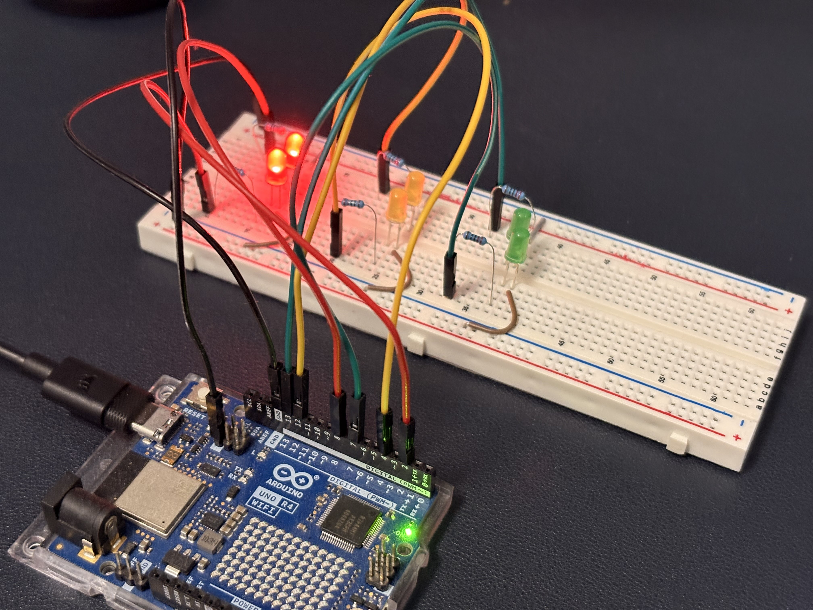
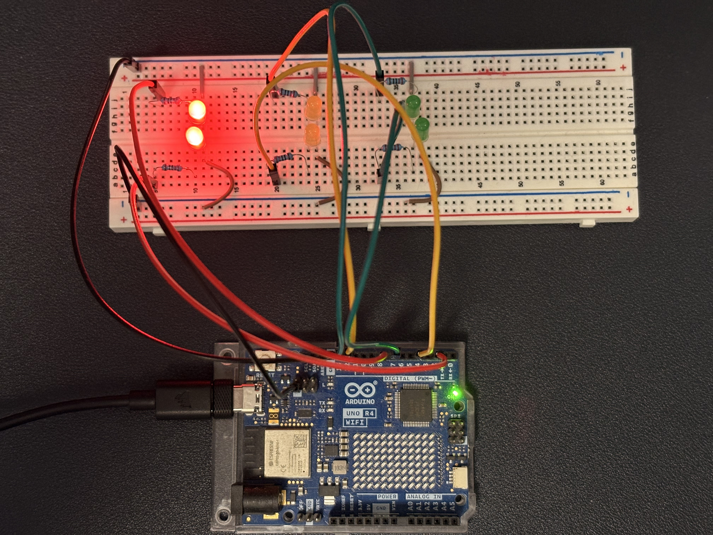

# IoT project - smart traffic light 🚦

Urban intersections frequently operate with **fixed-time programs**, disregarding short-term fluctuations in demand. A **vision-driven smart traffic light** is presented where a **Raspberry Pi** functions as the **central analysis and decision server**. Vehicle queues are estimated through computer vision, and **green time is allocated dynamically** to the busier approach, with the aim of improving **throughput, fairness, and safety** while avoiding specialized roadside sensors.

## Executive Summary
The system couples **on-device perception** with a **centralized control policy**. A YOLO-based pipeline provides vehicle counts per approach; a timing policy enforces **minimum/maximum green** and safe transitions (**yellow → all-red**) and switches phase only when **queue imbalance** is significant. Actuation occurs via a compact **TCP command protocol** to an Arduino/ESP32 node that drives physical LEDs.

## Motivation and Objectives
- **Traffic adaptivity:** align green time with measured demand rather than static schedules.  
- **Safety consistency:** enforce transitional states and fail-safe defaults.  
- **Low-cost deployment:** leverage commodity hardware and a line-based protocol.  
- **Privacy & latency:** process images on the Raspberry Pi; avoid cloud dependency.  
- **Scalability path:** generalize to multi-approach intersections and multi-node networks.

## System Overview
- **Raspberry Pi (central server):** camera ingestion (or test images), **YOLOv8** inference, smoothing/aggregation of counts, decision policy, TCP client.
- **Arduino/ESP32 (edge controller):** Wi‑Fi Access Point and **TCP server on port 8080**; parsing of line-terminated commands; deterministic GPIO control; explicit acknowledgments.

```
Camera/Video → Raspberry Pi (YOLO + smoothing + policy) ── TCP ──> Arduino/ESP32 → LEDs
```

## Architecture and Data Flow
1. **Frame acquisition:** camera stream or static test images.  
2. **Preprocessing:** optional resizing/cropping per lane Region of Interest.  
3. **Perception (YOLOv8n):** detection of vehicles (e.g., cars, trucks, buses, motorcycles); confidence thresholding.  
4. **Smoothing:** moving average over a short window for stable counts.  
5. **Decision:** evaluation of queue difference against `DIFF_THRESHOLD` with **min/max green** constraints.  
6. **Safety transitions:** `YELLOW` interval followed by `ALL_RED`.  
7. **Actuation:** command emission over TCP, newline-terminated, with ACK parsing.

## Control Policy (Overview)
- **Minimum green (`MIN_GREEN`):** prevent premature switching.  
- **Maximum green (`MAX_GREEN`):** prevent starvation of the opposing approach.  
- **Queue imbalance:** early switch permitted if the opposing smoothed count exceeds the current by more than `DIFF_THRESHOLD`.  
- **Oscillation control:** rolling mean suppresses jitter; larger windows increase stability at the cost of responsiveness.  
- **Fairness:** alternation is guaranteed by `MAX_GREEN`; starvation is bounded.

## Safety Model and Failure Modes
- **Transitions:** every phase change passes through **yellow** and **all-red** intervals.  
- **Device acknowledgments:** commands expect short replies (e.g., `ACK ...`).  
- **Communication failures:** TCP timeout on the Raspberry Pi triggers reconnect and at-least-once delivery; edge firmware should treat commands as **idempotent**.  
- **Inactivity handling:** after prolonged silence, the edge controller can remain in **ALL RED** as a safe default (policy recommended at firmware level).  

## Networking and Protocol
- **Topology:** Raspberry Pi as client; Arduino/ESP32 as Wi‑Fi AP and TCP server (`8080`).  
- **Protocol:** one-line commands terminated by `\n`, single-line ACK responses.  
- **Examples:**  
  - Single-side control: `R1`, `Y1`, `G1` ; `R2`, `Y2`, `G2`  
  - Combined phase: `S:GR` (Left=Green, Right=Red), `S:RG`, `S:YY`, `S:RR`  
  - Safety states: `ALL:RED`, `ALL:OFF`, `SAFE:G1`, `SAFE:G2`

## Learning and Centralized Decision-Making
The Raspberry Pi performs **inference** (object classification → vehicle counts) and converts signals into control actions. Training can be performed offline; inference runs at the edge. The **centralized decider** model simplifies coordination across approaches and enables aggregation of observations. A natural extension is **federated learning** across multiple intersections: local nodes retain raw data, share only model updates, and a coordinator on the central server aggregates parameters—preserving privacy while improving accuracy.

## Benefits
- **Lower average delay** through demand-responsive timings.  
- **Operational robustness** via explicit safety phases and ACK-checked commands.  
- **Modularity**: plug-in perception models, pluggable policies, simple transport.  
- **Portability**: deployable on Raspberry Pi 4/5; compatible with standard Arduino/ESP32 GPIO layouts.


## Arduino Part
[Code of Arduino Part](Arduino/Setup_Arduino/Setup_Arduino.ino)




## Raspberry Part

[Code and Server Architecture Overview](Raspberry/central_brain.ipynb)

The notebook includes an **in-depth analysis** of the Raspberry Pi module and the codebase—covering the vision pipeline, smoothing strategy, control state machine, and the TCP client/text protocol—presented as runnable cells with annotated explanations.


## Limitations & Future Work

- **Perception constraints:** performance depends on camera placement, lighting, and occlusions; lane-specific ROIs and calibration improve robustness.  
- **Real-time streaming:** current demo uses static images; integration with `cv2.VideoCapture` or RTSP streams is recommended for live operation.  
- **Multi-approach scaling:** extension to 3–4 approaches requires generalized phase graphs and fairness policies.  
- **Learning evolution:** centralized inference today; possible migration toward **federated learning** across intersections to preserve privacy while improving model accuracy.

## Author

**Andrea Maggiore** — Matricola 1947898  
Email: [maggiore.1947898@studenti.uniroma1.it](mailto:maggiore.1947898@studenti.uniroma1.it)